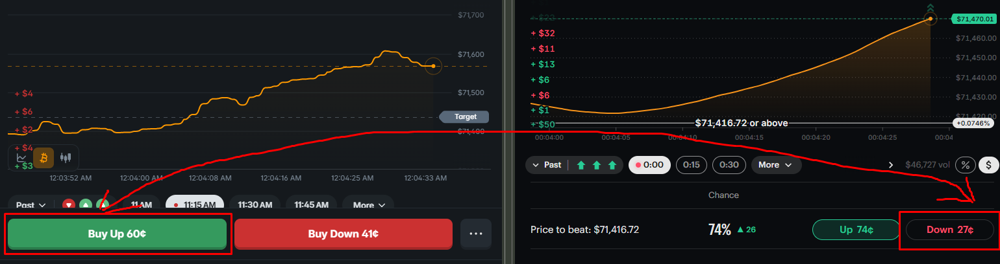
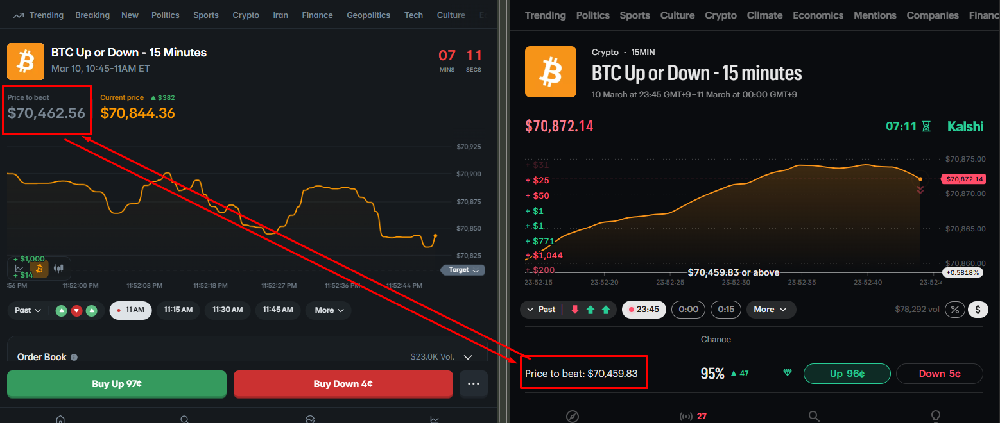
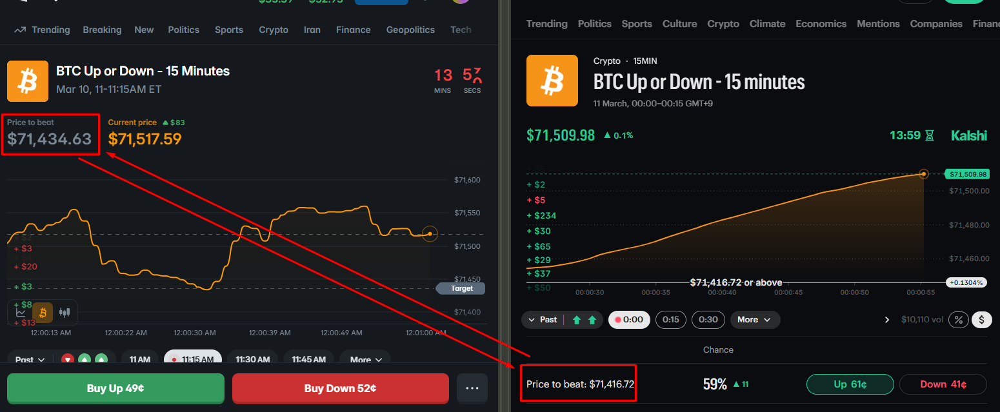
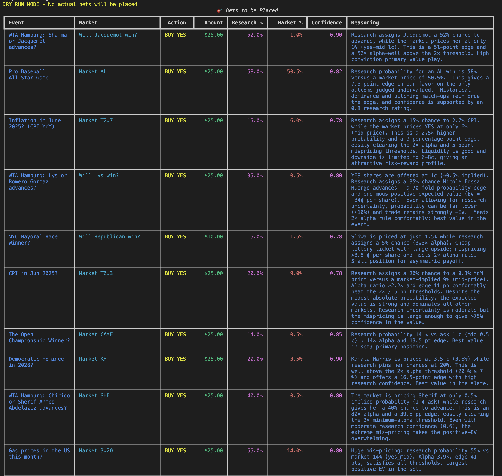

# Kalshi + Polymarket Arbitrage Trading Bot

A production-ready TypeScript toolkit for **Bitcoin 15-minute up/down** prediction markets on [Kalshi](https://kalshi.com) and [Polymarket](https://polymarket.com). Combines dual-venue monitoring, automated arbitrage detection, and cross-platform order execution.

---

## Table of Contents

- [Overview](#overview)
- [The Arbitrage Opportunity](#the-arbitrage-opportunity)
- [Research & Strategy](#research--strategy)
- [Features](#features)
- [Architecture](#architecture)
- [Quick Start](#quick-start)
- [Configuration](#configuration)
- [Usage Examples](#usage-examples)
- [Environment Reference](#environment-reference)
- [Programmatic API](#programmatic-api)
- [Developer](#developer)
- [Stack & Documentation](#stack--documentation)

---

## Overview

Both Kalshi and Polymarket offer Bitcoin 15-minute up/down markets: will BTC price be **up** or **down** at the end of a 15-minute window? Because these markets trade on separate order books, prices can diverge. When the **sum of opposite sides** (e.g., Kalshi UP + Polymarket DOWN) falls below a threshold, a risk-free or near–risk-free arbitrage exists.

This bot:

- Monitors best-ask prices on both venues in real time
- Detects when an arbitrage opportunity is in range `[ARB_SUM_LOW, ARB_SUM_THRESHOLD)`
- Places simultaneous limit orders on both platforms (configurable, with dry-run support)

---

## The Arbitrage Opportunity

### Same Market, Two Platforms

Both platforms trade the same underlying event (Bitcoin price at a fixed 15-minute close), but each has its own order book. Price differences create opportunities:



*Example: Buy UP on Kalshi (60¢) and DOWN on Polymarket (27¢). If UP + DOWN < 1, you lock in a guaranteed payoff.*

### When Opportunities Appear

**Small difference in "Price to beat"** — markets are closely aligned; arbitrage is rare:



*Polymarket: $70,462.56 vs Kalshi: $70,459.83 — nearly identical strike prices.*

**Large difference in "Price to beat"** — more divergence, more potential arb:



*Polymarket: $71,434.63 vs Kalshi: $71,416.72 — larger spread increases arb probability.*

### How the Bot Quantifies It

| Leg   | Kalshi | Polymarket | Sum  | Action                          |
|-------|--------|------------|------|----------------------------------|
| Leg 1 | Buy YES (UP)  | Buy DOWN | `kUp + polyDown` | Opportunity when sum ∈ [0.75, 0.92) |
| Leg 2 | Buy NO (DOWN) | Buy UP   | `kDown + polyUp` | Same trigger range                |

When `sum < 1`, one side pays out $1 and the other expires worthless; total cost < $1 ⇒ profit.

---

## Research & Strategy

The bot’s logic is driven by real-time order book data rather than research models. For event-based research and edge detection, the following example shows the kind of analysis that informs strategy design:



*Example of analytical output: Event, market, action, research vs market probability, confidence, and reasoning. The arb bot focuses on BTC 15m structural mispricing instead of event-level research.*

---

## Features

| Feature | Description |
|---------|-------------|
| **Balance** | Fetch Kalshi portfolio balance via REST |
| **Kalshi single order** | Place one limit order on the first open KXBTC15M market |
| **Dual-venue monitor** | Poll best-ask prices from Kalshi + Polymarket; log to 15m-slot files; optional restart at :00/:15/:30/:45 |
| **Cross-venue arb** | When sum ∈ `[ARB_SUM_LOW, ARB_SUM_THRESHOLD)`, place one order per venue (at most one per leg per market) |
| **Polymarket single order** | Place one limit buy for the DOWN token on the current BTC 15m market |

---

## Architecture

```
┌─────────────────────────────────────────────────────────────────┐
│                     npm start (Monitor + Arb)                     │
├─────────────────────────────────────────────────────────────────┤
│  Dual Price Monitor (KALSHI_MONITOR_INTERVAL_MS)                  │
│  ├── Kalshi REST API (kalshi-typescript) → getMarket / orderbook   │
│  └── Polymarket CLOB + Gamma → getOrderBook / slug resolution      │
│       ↓                                                           │
│  checkArbAndPlaceOrders(DualMarketPrices)                          │
│  ├── sumUp = kUp + polyDown  →  Leg 1: Kalshi YES + Poly DOWN     │
│  └── sumDown = kDown + polyUp → Leg 2: Kalshi NO  + Poly UP       │
│       ↓                                                           │
│  placeOrder (Kalshi) + placePolymarketOrder (Polymarket)           │
└─────────────────────────────────────────────────────────────────┘
```

---

## Quick Start

### 1. Clone and Install

```bash
git clone <your-repo-url>
cd Polymarket-Kalshi-Arbitrage-Trading-Bot
npm install
```

### 2. Configure Environment

```bash
cp .env.sample .env
```

Edit `.env` with:

- **Kalshi:** `KALSHI_API_KEY`, `KALSHI_PRIVATE_KEY_PATH` or `KALSHI_PRIVATE_KEY_PEM`
- **Polymarket (optional):** `POLYMARKET_PRIVATE_KEY`, `POLYMARKET_PROXY` for arb on both legs

### 3. Run Commands

```bash
# Check Kalshi balance
npm run balance

# Place one Kalshi order (dry run first)
KALSHI_BOT_DRY_RUN=true npm run kalshi-single-order

# Start dual monitor + arb
npm start
```

---

## Configuration

### Kalshi Authentication

Kalshi uses RSA-PSS signing. Provide either:

- `KALSHI_PRIVATE_KEY_PATH` — path to your `.pem` file  
- `KALSHI_PRIVATE_KEY_PEM` — PEM string (e.g. from env / secrets manager)

### Polymarket (Optional)

- `POLYMARKET_PRIVATE_KEY` — wallet private key (hex, with or without `0x`)
- `POLYMARKET_PROXY` — Polymarket proxy/funder address

If Polymarket credentials are not set, the arb bot will only place Kalshi orders.

### Dry Run Mode

Always test without real money:

```bash
KALSHI_BOT_DRY_RUN=true npm run kalshi-single-order
ARB_DRY_RUN=true npm start
```

---

## Usage Examples

### Kalshi Single Order

```bash
# Dry run
KALSHI_BOT_DRY_RUN=true npm run kalshi-single-order

# Live: Buy YES (UP) @ 50¢, 2 contracts
KALSHI_BOT_SIDE=yes KALSHI_BOT_PRICE_CENTS=50 KALSHI_BOT_CONTRACTS=2 npm run kalshi-single-order

# Buy NO (DOWN) @ 45¢
KALSHI_BOT_SIDE=no KALSHI_BOT_PRICE_CENTS=45 KALSHI_BOT_CONTRACTS=1 npm run kalshi-single-order
```

### Polymarket Single Order

```bash
# Place one limit buy: DOWN token @ 0.45, size 10
npm run poly-single-order 0.45 10

# Default (uses config defaults)
npm run poly-single-order
```

### Monitor & Arb

```bash
# Start dual monitor + arb (single-instance lock)
npm start
```

- Logs: `logs/monitor_YYYY-MM-DD_HH-{00|15|30|45}.log`
- Lock file: `logs/monitor.lock` (prevents duplicate processes)
- Without `KALSHI_MONITOR_TICKER`, the process can restart at quarter-hour boundaries to pick up new markets

---

## Environment Reference

| Variable | Description | Default |
|----------|-------------|---------|
| **Kalshi** | | |
| `KALSHI_API_KEY` | API key ID | required |
| `KALSHI_PRIVATE_KEY_PATH` | Path to RSA private key `.pem` | — |
| `KALSHI_PRIVATE_KEY_PEM` | PEM string (alternative to path) | — |
| `KALSHI_DEMO` | Use demo env (`demo-api.kalshi.co`) | `false` |
| `KALSHI_BASE_PATH` | Override API base URL | prod or demo |
| **Bot** | | |
| `KALSHI_BOT_SIDE` | `yes` or `no` | `yes` |
| `KALSHI_BOT_PRICE_CENTS` | Limit price 1–99 | `50` |
| `KALSHI_BOT_CONTRACTS` | Contracts per order | `1` |
| `KALSHI_BOT_MAX_MARKETS` | Max markets to consider | `1` |
| `KALSHI_BOT_DRY_RUN` | No real Kalshi orders | `false` |
| **Monitor** | | |
| `KALSHI_MONITOR_INTERVAL_MS` | Poll interval (ms) | `2000` |
| `KALSHI_MONITOR_TICKER` | Fixed ticker (skip auto-refresh) | — |
| `KALSHI_MONITOR_NO_RESTART` | Disable 15m restart | — |
| **Arb** | | |
| `ARB_SUM_THRESHOLD` | Upper bound for opportunity | `0.92` |
| `ARB_SUM_LOW` | Lower bound (ignore if below) | `0.75` |
| `ARB_PRICE_BUFFER` | Add to captured ask for limit | `0.01` |
| `ARB_SIZE` | Size on both platforms | `1` |
| `ARB_DRY_RUN` | Log only, no orders | `false` |
| **Polymarket** | | |
| `POLYMARKET_PRIVATE_KEY` | Wallet private key | — |
| `POLYMARKET_PROXY` | Proxy/funder address | — |
| `POLYMARKET_CLOB_URL` | CLOB API URL | `https://clob.polymarket.com` |
| `POLYMARKET_CHAIN_ID` | Chain ID (137 = Polygon) | `137` |

See `.env.sample` for the full list.

---

## Programmatic API

### Kalshi

```typescript
import { placeOrder } from "./bot";

const result = await placeOrder("KXBTC15M-24MAR10-2330", "yes", 2, 50);
// { orderId: "..." } or { error: "..." }
```

### Polymarket

```typescript
import { placePolymarketOrder } from "./polymarket-order";
import { getTokenIdsForSlugCached } from "./polymarket-monitor";

const { upTokenId, downTokenId } = await getTokenIdsForSlugCached("btc-updown-15m-20240310-2300");
const result = await placePolymarketOrder(downTokenId, 0.45, 10);
```

---

## Developer

**Alexei** — Expert in trading bot development (EVM, Solana, Polymarket, Kalshi, prediction markets).

Questions? [Telegram](https://t.me/@tova_0x)

---

## Stack & Documentation

| Resource | URL |
|----------|-----|
| **Packages** | [kalshi-typescript](https://www.npmjs.com/package/kalshi-typescript), [@polymarket/clob-client](https://www.npmjs.com/package/@polymarket/clob-client), ethers |
| **Kalshi API** | [docs.kalshi.com](https://docs.kalshi.com/) |
| **TypeScript SDK** | [Quick Start](https://docs.kalshi.com/sdks/typescript/quickstart) |
| **WebSockets** | [WebSocket Connection](https://docs.kalshi.com/websockets/websocket-connection) |

---

**Tech:** Node.js, TypeScript, Kalshi REST API, Polymarket CLOB, Gamma API for market resolution.
